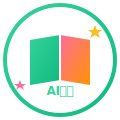

# 🌟 AI伴读小精灵 (StudyBuddy)

<p align="center">
  
</p>

<p align="center">
  <strong>让学习像游戏一样有趣，让陪伴随时随地</strong>
</p>

<p align="center">
  <a href="#功能特色">功能特色</a> •
  <a href="#快速开始">快速开始</a> •
  <a href="#技术栈">技术栈</a> •
  <a href="#项目结构">项目结构</a>
</p>

---

## ✨ 功能特色

### 🎥 AI视频监督
- 可爱的AI虚拟人实时陪伴
- 专注度智能检测
- 异常行为即时提醒

### 🎮 特工任务系统
- 游戏化的任务看板
- 星星奖励与成就系统
- 完成任务像闯关一样有趣

### 📚 智能学习助手
- 背诵模式：AI陪读，语音评测
- 听写模式：AI朗读，拍照批改
- 作业批改：拍照即可获得详细解析

### 👨‍👩‍👧 家长监控中心
- 实时查看学习状态
- 制定学习计划
- 详细的学习报告

---

## 🚀 快速开始

### 环境要求
- 现代浏览器 (Chrome, Safari, Firefox)
- 本地服务器 (可选)

### 运行项目

```bash
# 克隆项目
git clone [repository-url]

# 进入项目目录
cd AI-Study-Buddy

# 使用任意本地服务器运行，例如：
python -m http.server 8080
# 或
npx serve src
```

然后在浏览器中打开 `http://localhost:8080/src/`

---

## 🛠 技术栈

| 技术 | 用途 |
|------|------|
| HTML5 | 页面结构 |
| CSS3 | 样式和动画 |
| JavaScript | 交互逻辑 |
| FontAwesome 6 | 图标库 |
| Apple Design | 设计语言 |
| Lottie | 动画效果 |

---

## 📁 项目结构

```
AI-Study-Buddy/
├── docs/                    # 文档
│   └── PRODUCT_ANALYSIS.md  # 产品分析文档
├── src/                     # 源代码
│   ├── assets/              # 静态资源
│   │   ├── icons/           # 图标
│   │   └── images/          # 图片
│   ├── css/                 # 样式文件
│   │   ├── style.css        # 全局样式
│   │   ├── components.css   # 组件样式
│   │   └── pages/           # 页面样式
│   ├── js/                  # JavaScript
│   │   ├── app.js           # 主入口
│   │   ├── router.js        # 路由管理
│   │   └── components/      # 组件脚本
│   ├── pages/               # 页面HTML
│   └── index.html           # 入口页面
└── README.md                # 项目说明
```

---

## 📱 页面预览

| 首页 | 视频监督 | 任务看板 | 家长中心 |
|------|---------|---------|---------|
| 🏠 | 🎥 | 📋 | 👨‍👩‍👧 |

---

## 🎨 设计规范

- **设计语言**: Apple Human Interface Guidelines
- **主色调**: 粉紫渐变 (#FF9A9E → #FECFEF)
- **圆角**: 16-24px
- **字体**: SF Pro Display, PingFang SC

---

## 📄 License

MIT License

---

<p align="center">
  Made with ❤️ for kids' better learning experience
</p>

